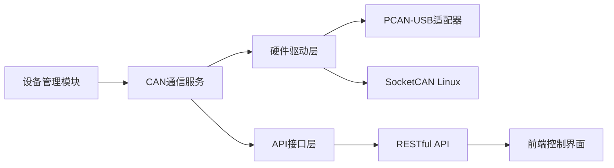

# Go CAN 总线通信库集成与使用指南

## 1. 文档目标
提供基于Go语言的CAN总线通信集成方案，适用于分析仪器设备管理系统中的设备通信模块开发。本文档遵循[PRD文档管理规范与偏好](PRD文档管理规范与偏好)标准。

## 2. 核心技术方案

### 2.1 主要库选择

#### [einride/can-go](https://github.com/einride/can-go)
目前Go语言中最完善的CAN总线通信库，提供硬件抽象层和跨平台支持。

**安装命令**:
```bash
go get github.com/einride/can-go
```

### 2.2 基础架构设计



## 3. 详细实现方案

### 3.1 Windows平台集成

由于用户环境为Windows 24H2，需特别注意以下事项：

1. **硬件要求**:
   - PEAK-System PCAN-USB适配器
   - PCAN-Basic Windows驱动安装

2. **驱动适配层实现**:

```go
package can

import (
	"context"
	"github.com/einride/can-go/pkg"
	"github.com/peak-system/pcan-go"
)

// WindowsPCANDriver 实现can.Driver接口
type WindowsPCANDriver struct {
	handle pcan.Handle
}

func NewWindowsDriver(channel string) (*WindowsPCANDriver, error) {
	handle, err := pcan.Initialize(channel, pcan.PCIBUS)
	if err != nil {
		return nil, err
	}
	return &WindowsPCANDriver{handle: handle}, nil
}

func (d *WindowsPCANDriver) WriteFrame(ctx context.Context, frame can.Frame) error {
	// 实现PCAN写入逻辑
	return pcan.Write(d.handle, frameToPCAN(frame))
}

func (d *WindowsPCANDriver) ReadFrame(ctx context.Context) (can.Frame, error) {
	// 实现PCAN读取逻辑
	pcanFrame, err := pcan.Read(d.handle)
	return pcanToFrame(pcanFrame), err
}

// ... 其他接口方法实现
```

### 3.2 基础通信示例

``go
package main

import (
	"context"
	"log"
	"time"

	can "github.com/einride/can-go/pkg"
)

func main() {
	// 创建Windows专用驱动 (示例)
	// driver, err := NewWindowsDriver("PCAN_USBBUS1")
	
	// Linux使用SocketCAN
	// driver, err := socketcan.NewDriver("can0")
	
	bus := can.NewBus(driver)
	
	// 启动总线
	if err := bus.Start(context.Background()); err != nil {
		log.Fatalf("failed to start bus: %v", err)
	}
	
	// 订阅特定CAN ID
	sub := bus.Subscribe(0x123)
	defer sub.Cancel()
	
	// 发送CAN帧示例
	if err := bus.WriteFrame(can.Frame{
		ID:      0x123,
		Data:    []byte{0x01, 0x02, 0x03, 0x04},
		Length:  4,
		IsExtendedID: false,
	}); err != nil {
		log.Fatalf("failed to send frame: %v", err)
	}
	
	// 接收处理循环
	for {
		select {
		case frame := <-sub.C:
			log.Printf("Received: ID=0x%X Data=%v", frame.ID, frame.Data)
			// 处理接收到的帧
		case <-time.After(5 * time.Second):
			log.Println("Timeout waiting for messages")
			return
		}
	}
}
```

## 4. 系统集成规范

### 4.1 设备通信管理模块集成

| 模块 | 集成点 | 规范要求 |
|------|--------|----------|
| 设备管理系统 | can-service | 实现统一设备通信抽象层 |
| 控制模块 | task-queue | CAN消息与任务队列关联 |
| 日志管理 | logs | 记录所有CAN通信日志 |
| 告警系统 | alerts | 基于CAN通信异常触发告警 |

### 4.2 API设计规范

**RESTful API接口**:

| 端点 | 方法 | 功能 | 请求体 | 响应 |
|------|------|------|---------|-------|
| /api/can/connect | POST | 建立CAN连接 | {"channel":"PCAN_USBBUS1"} | {"status":"connected", "id":"session123"} |
| /api/can/disconnect | POST | 断开连接 | {"id":"session123"} | {"status":"disconnected"} |
| /api/can/send | POST | 发送CAN帧 | {"id":"session123", "frame":{"id":291, "data":[1,2,3,4]}} | {"status":"sent", "timestamp":"2023-09-19T10:30:00Z"} |
| /api/can/subscribe | GET | 订阅CAN消息 | {"id":"session123", "canId":291} | SSE流式响应 |

### 4.3 数据库设计

**新增CAN相关表结构**:

```
-- CAN通信会话表
cREATE TABLE can_sessions (
    id VARCHAR(36) PRIMARY KEY,
    channel VARCHAR(50) NOT NULL,
    created_at TIMESTAMP DEFAULT CURRENT_TIMESTAMP,
    status VARCHAR(20) CHECK (status IN ('active', 'inactive', 'error'))
);

-- CAN消息记录表
cREATE TABLE can_messages (
    id SERIAL PRIMARY KEY,
    session_id VARCHAR(36) REFERENCES can_sessions(id),
    can_id INT NOT NULL,
    data BYTEA NOT NULL,
    timestamp TIMESTAMP DEFAULT CURRENT_TIMESTAMP,
    direction VARCHAR(10) CHECK (direction IN ('sent', 'received'))
);

-- CAN设备配置表
cREATE TABLE can_devices (
    device_id VARCHAR(50) PRIMARY KEY,
    can_id INT UNIQUE NOT NULL,
    description TEXT,
    last_seen TIMESTAMP
);
```

## 5. 测试策略

### 5.1 单元测试要点

``go
func TestCanCommunication(t *testing.T) {
	// 创建模拟驱动
	mockDriver := &can.MockDriver{
		ReadFrameFunc: func(ctx context.Context) (can.Frame, error) {
			return can.Frame{ID: 0x123, Data: []byte{0x01}}, nil
		},
	}

	bus := can.NewBus(mockDriver)
	require.NoError(t, bus.Start(context.Background()))

	sub := bus.Subscribe(0x123)
	frame, err := sub.Receive(context.Background())

	require.NoError(t, err)
	require.Equal(t, 0x123, frame.ID)
	require.Equal(t, []byte{0x01}, frame.Data)
}
```

### 5.2 集成测试方案

1. **硬件仿真测试**:
   - 使用PCAN-View进行硬件仿真
   - 验证Windows驱动兼容性

2. **通信可靠性测试**:
   - 消息丢失率测试（目标：<0.1%）
   - 高负载测试（1000帧/秒）
   - 网络中断恢复测试

3. **SPC过程控制测试**:
   - 基于CAN数据的统计过程控制
   - 异常数据检测与告警触发


## 7. 风险与应对

| 风险 | 影响 | 应对措施 |
|------|------|----------|
| Windows驱动兼容性问题 | 开发延迟 | 提前验证PCAN-Basic驱动版本 |
| CAN消息丢失 | 数据完整性受损 | 实现消息确认机制与重传策略 |
| 高并发性能瓶颈 | 系统响应延迟 | 优化消息队列与缓冲机制 |
| 硬件访问权限问题 | 功能受限 | 申请管理员权限或服务化部署 |

## 8. 参考资料

1. [einride/can-go GitHub仓库](https://github.com/einride/can-go)
2. [PCAN-Basic Windows驱动文档](https://www.peak-system.com/PCAN-Basic.242.0.html)
3. [CAN总线协议规范](https://www.bosch-semiconductors.com/media/en/pdf_1/can2spec.pdf)
4. [Go语言系统编程最佳实践](Go Gin 基于配置文件自动导入模块包.md)

# Go-Can-Demo
